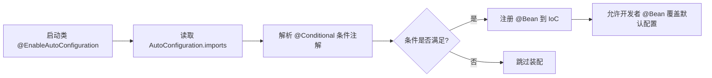

# Spring Boot 核心技术精要笔记

## 📖 目录
- [1. 核心设计哲学：约定优于配置](#1-核心设计哲学约定优于配置)
- [2. `@SpringBootApplication` 三合一注解拆解](#2-springbootapplication-三合一注解拆解)
- [3. Starter 依赖原理](#3-starter-依赖原理)
- [4. 自动配置机制深度解析](#4-自动配置机制深度解析)
- [5. 内嵌 Web 服务器优势](#5-内嵌-web-服务器优势)
- [6. 启动条件思考题与解析](#6-启动条件思考题与解析)
- [7. 总结与课后练习](#7-总结与课后练习)

---

## 1. 核心设计哲学：约定优于配置
**约定优于配置**（Convention over Configuration, CoC）是 Spring Boot 的底层架构基石。其核心思想是：**框架提供一套合理的默认行为，开发者仅在偏离默认约定时才需要显式配置。**

| 传统 Spring 开发痛点 | Spring Boot 解决方案 |
|:---|:---|
| 繁琐的 XML/JavaConfig 声明 | **零配置启动**，自动推断依赖并装配 |
| 依赖版本冲突（Jar Hell） | 通过 **Parent POM** 统一版本仲裁 |
| 外部容器部署流程复杂 | **内嵌容器**，打包为可执行 JAR/WAR |
| 环境差异导致配置漂移 | 多环境配置文件 `application-{profile}.yml` 规范化管理 |

> 💡 **核心理念**：将开发者的注意力从“如何搭建环境”转移到“如何编写业务逻辑”。

---

## 2. `@SpringBootApplication` 三合一注解拆解
该注解是 Spring Boot 应用的**入口标识**，本质是一个**组合注解**（Composite Annotation）。

```java
@SpringBootConfiguration
@EnableAutoConfiguration
@ComponentScan(excludeFilters = { @Filter(type = FilterType.CUSTOM, classes = TypeExcludeFilter.class),
        @Filter(type = FilterType.CUSTOM, classes = AutoConfigurationExcludeFilter.class) })
public @interface SpringBootApplication {
    // ... 属性省略
}
```

| 组成注解 | 核心职责 | 关键说明 |
|:---|:---|:---|
| **`@SpringBootConfiguration`** | 声明当前类为配置类 | 继承自 `@Configuration`，标记该类可被 IoC 容器扫描并加载 Bean |
| **`@EnableAutoConfiguration`** | 开启自动配置机制 | 触发 `AutoConfigurationImportSelector`，加载 `spring.factories` / `AutoConfiguration.imports` 中的配置类 |
| **`@ComponentScan`** | 开启组件扫描 | 默认扫描**当前类所在包及其子包**下的 `@Component`、`@Service`、`@Controller` 等注解 |

---

## 3. Starter 依赖原理
**Starter** 是一组依赖的聚合描述器，用于简化 Maven/Gradle 依赖管理。

### 📦 依赖结构示例 (`pom.xml`)
```xml
<dependencies>
    <!-- 核心 Web Starter：聚合了 spring-webmvc, embedded-tomcat, jackson, validation 等 -->
    <dependency>
        <groupId>org.springframework.boot</groupId>
        <artifactId>spring-boot-starter-web</artifactId>
    </dependency>
</dependencies>
```

### 🔍 工作原理
1. **依赖聚合**：Starter 自身通常不包含代码，仅通过 `<dependencies>` 引入相关第三方库。
2. **版本仲裁**：继承 `spring-boot-starter-parent` 或导入 `spring-boot-dependencies` BOM，由 Spring Boot 官方统一锁定兼容版本。
3. **按需加载**：引入 Starter 仅表示“具备使用某功能的依赖”，**不会强制生效**，实际装配由**条件注解**控制。

---

## 4. 自动配置机制深度解析
自动配置是 Spring Boot 的“大脑”，通过**条件化装配**实现按需加载。

### 🔄 核心工作流


### ⚙️ 关键条件注解逻辑
自动配置大量依赖 `org.springframework.boot.autoconfigure.condition` 包下的条件注解。核心匹配逻辑可用数学表达式概括：

$$
\text{RegisterBean} \iff \underbrace{\text{ClassPath中存在目标类}}_{\text{@ConditionalOnClass}} \land \underbrace{\nexists \text{同名/同类型Bean}}_{\text{@ConditionalOnMissingBean}}
$$

| 注解 | 触发时机 | 典型应用场景 |
|:---|:---|:---|
| **`@ConditionalOnClass`** | 类路径存在指定 Class 文件 | 引入 `mysql-connector-java` 后自动装配数据源 |
| **`@ConditionalOnMissingBean`** | IoC 容器中**不存在**指定 Bean | 允许开发者自定义 Bean 时，覆盖框架默认实现 |
| **`@ConditionalOnProperty`** | `application.yml` 存在指定属性且匹配 | `spring.datasource.enabled=true` 时开启数据源 |
| **`@ConditionalOnWebApplication`** | 当前为 Web 环境 | 自动配置 DispatcherServlet、内嵌容器等 |

### 🛠️ 自定义自动配置示例
```java
@Configuration(proxyBeanMethods = false)
@ConditionalOnClass(MyService.class)          // 1. 依赖存在才生效
@ConditionalOnProperty(prefix = "my", name = "enabled", havingValue = "true") // 2. 配置开关控制
public class MyAutoConfiguration {

    @Bean
    @ConditionalOnMissingBean(MyService.class) // 3. 用户未自定义时才创建默认 Bean
    public MyService myService() {
        return new DefaultMyService();
    }
}
```

> ⚠️ **覆盖原则**：开发者手动声明的 `@Bean` 优先级**高于**自动配置。Spring 会在注册自动配置前检查容器，若已存在则跳过。

---

## 5. 内嵌 Web 服务器优势
Spring Boot 默认将 **Tomcat/Jetty/Undertow** 打包进应用 JAR 中，实现“应用即容器”。

| 优势维度 | 传统外部容器部署 | Spring Boot 内嵌容器 |
|:---|:---|:---|
| **部署复杂度** | 需安装、配置 Tomcat，手动打 WAR 包，放置 `webapps` | 执行 `java -jar app.jar` 即可运行 |
| **环境一致性** | 开发、测试、生产容器版本易不一致导致“在我机器上能跑” | **环境隔离**，JVM 级别保证一致性 |
| **资源调度** | 共享容器，应用间可能互相影响（内存泄漏、线程池争抢） | **独立进程**，资源边界清晰，适合云原生/K8s |
| **DevOps 友好** | 需编写复杂脚本管理容器生命周期 | 原生支持健康检查、优雅停机、Actuator 监控 |

---

## 6. 启动条件思考题与解析

### 💭 思考题 1：为什么引入 `spring-boot-starter-web` 后，没有配置 `server.port` 也能启动在 8080？
> **解析提示**：自动配置机制读取 `org.springframework.boot.autoconfigure.web.ServerProperties`，该属性类绑定了 `server.*` 前缀配置。若未显式配置，则使用 `@Value("${server.port:8080}")` 的默认值 `8080`。

### 💭 思考题 2：项目中同时引入了 `spring-boot-starter-web` 和 `spring-boot-starter-jetty`，最终会使用哪个容器？
> **解析提示**：Spring Boot 依赖仲裁机制中，**后引入的依赖会覆盖前者**，但更推荐通过 `<exclusions>` 排除 `spring-boot-starter-tomcat`。底层由 `ServletWebServerFactoryAutoConfiguration` 根据 `Conditional` 和 `@Order` 决定实例化哪个 `WebServerFactory`。

### 💭 思考题 3：自定义了一个 `DataSource` Bean，为什么自动配置的数据源连接池（如 HikariCP）没有生效？
> **解析提示**：`DataSourceAutoConfiguration` 内部使用了 `@ConditionalOnMissingBean(DataSource.class)`。开发者提前声明 `@Bean public DataSource dataSource()` 后，IoC 容器已存在该类型 Bean，条件判断为 `false`，自动配置**主动跳过**，完美体现“约定不覆盖显式配置”。

---

## 7. 总结与课后练习

### 📝 核心要点回顾
1. **约定优于配置**：通过合理默认值减少样板代码，提升开发效率。
2. **三合一注解**：`@SpringBootApplication` = `@Configuration` + `@EnableAutoConfiguration` + `@ComponentScan`。
3. **Starter 本质**：依赖聚合器 + 版本仲裁器，不直接触发代码执行。
4. **自动配置核心**：依赖 `@Conditional*` 系列注解实现**按需装配**与**优雅覆盖**。
5. **内嵌容器**：实现应用自包含，契合云原生部署范式。

### 🧪 课后练习
1. **动手实践**：创建一个 Spring Boot 项目，仅引入 `spring-boot-starter-data-redis`，不写任何业务代码。启动后观察控制台日志，说明 Redis 自动配置是如何触发的？若注释掉 `spring-boot-starter-data-redis` 依赖，日志有何变化？
2. **源码追踪**：使用 IDE 进入 `@EnableAutoConfiguration`，找到 `AutoConfigurationImportSelector`，尝试定位它是如何读取 `AutoConfiguration.imports` 文件的。
3. **条件注解实战**：编写一个自定义 Starter，要求包含 `@ConditionalOnClass`、`@ConditionalOnMissingBean` 和 `@ConfigurationProperties`，实现当引入该 Starter 且配置 `custom.enabled=true` 时，向容器中注入一个默认服务 Bean。验证在显式声明同名 Bean 时，默认 Bean 是否被正确跳过。

> 🌟 **技术分享建议**：在社团分享时，可配合 IDEA 的 `Diagram` 插件展示自动配置类的依赖拓扑，或使用 `spring-boot-starter-actuator` 的 `/actuator/conditions` 接口现场演示条件匹配结果，效果极佳。